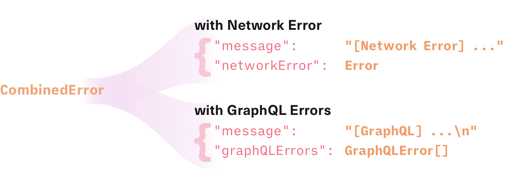
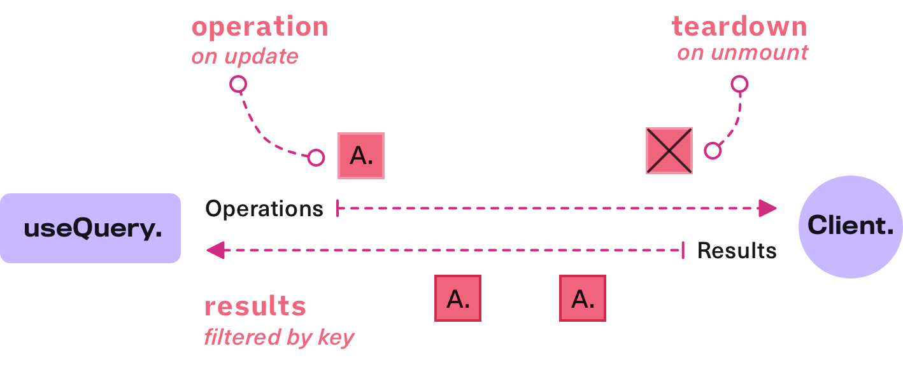
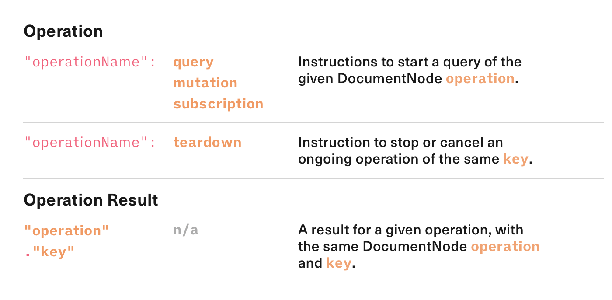
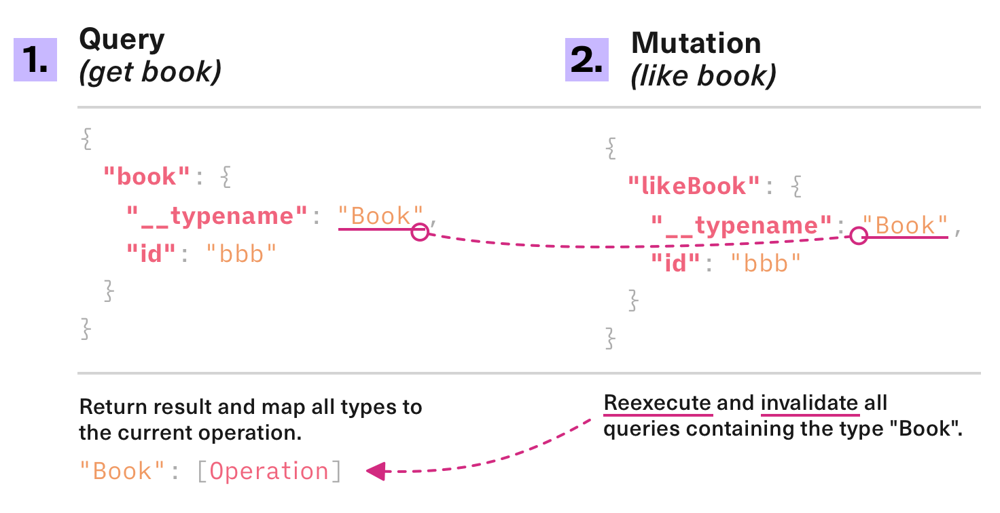

<div align="center">
  

  <br />
  <br />

  <strong>
    A highly customisable and versatile GraphQL client for React
  </strong>

  <br />
  <br />
  <a href="https://npmjs.com/package/urql">
    
  </a>
  <a href="https://travis-ci.com/FormidableLabs/urql">
    
  </a>
  <a href="https://codecov.io/gh/FormidableLabs/urql">
    
  </a>
  <a href="https://bundlephobia.com/result?p=urql">
    
  </a>
  <a href="https://github.com/FormidableLabs/urql#maintenance-status">
    
  </a>
  <a href="https://spectrum.chat/urql">
    
  </a>

  <br />
  <br />
</div>

## ✨ Features

- 📦 **One package** to get a working GraphQL client in React
- ⚙️ Fully **customisable** behaviour [via "exchanges"](#-add-on-exchanges)
- 🗂 Logical but simple default behaviour and document caching
- ⚛️ Minimal React components and hooks
- 🌱 Normalized caching via [`@urql/exchange-graphcache`](https://github.com/FormidableLabs/urql-exchange-graphcache)

`urql` is a GraphQL client that exposes a set of React components and hooks. It's built to be highly customisable and versatile so you can take it from getting started with your first GraphQL project all the way to building complex apps and experimenting with GraphQL clients.

While GraphQL is an elegant protocol and schema language, client libraries today typically come with large API footprints. We aim to create something more lightweight instead.

Some of the available exchanges that extend `urql` are listed below in the ["Add on Exchanges" list](https://github.com/FormidableLabs/urql#-add-on-exchanges) including a normalized cache and a Chrome devtools extension.

## 📃 [Documentation](https://formidable.com/open-source/urql/docs)

[The documentation contains everything you need to know about `urql`](https://formidable.com/open-source/urql/docs)

- [Getting Started guide](https://formidable.com/open-source/urql/docs/getting-started/)
- [Architecture](https://formidable.com/open-source/urql/docs/architecture/)
- [Basics](https://formidable.com/open-source/urql/docs/basics/)
- [Extending & Experimenting](https://formidable.com/open-source/urql/docs/extending-&-experimenting/)
- [API](https://formidable.com/open-source/urql/docs/api/)
- [Guides](./docs/guides.md)

_You can find the raw markdown files inside this repository's `docs` folder._

## 🏎️ Intro & Showcase

### Installation

```sh
yarn add urql graphql
# or
npm install --save urql graphql
```

### Queries

There are three hooks, one for each possible GraphQL operation.

The [`useQuery` hook](https://formidable.com/open-source/urql/docs/api/#usequery-hook) is
used to send GraphQL queries and will provide GraphQL results from your API.

When you're using `useQuery` it'll accept a configuration object that may contain keys for `query` and `variables`.
The `query` can either be your GraphQL query as a string or as a `DocumentNode`, which may be
parsed using [`graphql-tag`](https://github.com/apollographql/graphql-tag) for instance.

```js
import { useQuery } from 'urql';

const YourComponent = () => {
  const [result] = useQuery({
    query: `{ todos { id } }`,
  });

  if (result.error) return <Error message={result.error.message} />;
  if (result.fetching) return <Loading />;

  return <List data={result.data.todos} />;
};
```

Internally, `urql` will create a unique `key` for any operation it starts which is a hash of `query` and
`variables`. The internal "Exchange pipeline" is then responsible for fulfilling the operation.


The result's error is a [`CombinedError`](https://formidable.com/open-source/urql/docs/api/#combinederror-class), which
normalises GraphQL errors and Network errors by combining them into one wrapping class.



[Learn more about `useQuery` in the Getting Started guide](https://formidable.com/open-source/urql/docs/getting-started/#writing-queries)

### Mutations

The [`useMutation` hook](https://formidable.com/open-source/urql/docs/api/#usemutation-hook) is very similar to the `useQuery` hook,
but instead of sending queries it sends mutations whenever the `executeMutation` method is called with the variables for the mutation.

```js
import { useMutation } from 'urql';

const YourComponent = () => {
  const [result, executeMutation] = useMutation(
    `mutation AddTodo($text: String!) { addTodo(text: $text) { id } }`
  );

  const add = () =>
    executeMutation({ text: 'New todo!' }).then(result => {
      /* ... */
    });

  return <button onClick={add}>Go!</button>;
};
```

The `useMutation` hook provides a result, just like `useQuery` does, but it doesn't execute the mutation automatically.
Instead it starts once the `executeMutation` function is called with some variables. This also returns a promise that
resolves to the result as well.

[Learn more about `useMutation` in the Getting Started guide](https://formidable.com/open-source/urql/docs/getting-started/#writing-mutations)

### Pausing and Request Policies

The `useQuery` hook and `useMutation` hook differ by when their operations execute by default.
Mutations will only execute once the `executeMutation` method is called with some variables.
The `useQuery` hook can actually be used similarly. The hook also provides an `executeQuery`
function that can be called imperatively to change what query the hook is running.

Unlike the `useMutation` hook, the `useQuery`'s `executeQuery` function accepts an `OperationContext` as the argument, this allows you to for example override the `requestPolicy` or even the `fetchOptions`.

```js
const [result, executeQuery] = useQuery({
  query: 'query ($sort: Sorting!) { todos(sort: $sort) { text } }',
  variables: { sort: 'by-date' },
});

// executeQuery can trigger queries and override options
const update = () => executeQuery({ requestPolicy: 'network-only' });
```

Instead of running the `useQuery` operation eagerly you may also pass `pause: true`, which causes the
hook not to run your query automatically until `pause` becomes `false` or until `executeQuery` is called
manually.

```js
// This won't execute automatically...
const [result, executeQuery] = useQuery({
  query: '{ todos { text } }',
  pause: true,
});

// ...but it can still be triggered programmatically
const execute = () => executeQuery();
```

Apart from `pause` you may also pass a `requestPolicy` option that changes how the cache treats your data.
By default this option will be set to `"cache-first"` which will give you cached data when it's available,
but it can also be set to `"network-only"` which skips the cache entirely and refetches. Another option is
`"cache-and-network"` which may give you cached data but then refetches in the background.

```js
const [result, executeQuery] = useQuery({
  query: '{ todos { text } }',
  // Refetch up-to-date data in the background
  requestPolicy: 'cache-and-network',
});

// this will tell you whether something is fetching in the background
result.stale; // true
```

Therefore to [refetch data for your `useQuery` hook](https://formidable.com/open-source/urql/docs/getting-started/#refetching-data),
you can call `executeQuery` with the `network-only` request policy.

```js
const [result, executeQuery] = useQuery({
  query: '{ todos { text } }',
});

// We change the requestPolicy to bypass the cache just this once
const refetch = () => executeQuery({ requestPolicy: 'network-only' });
```

[Learn more about request policies in our Getting Started section!](https://formidable.com/open-source/urql/docs/getting-started/#refetching-data)

### Client and Exchanges

In `urql` all operations are controlled by a central [`Client`](https://formidable.com/open-source/urql/docs/api/#client-class).
This client is responsible for managing GraphQL operations and sending requests.


Any hook in `urql` dispatches its operation on the client (A, B, C) which will be handled by the client on a
single stream of inputs. As responses come back from the cache or your GraphQL API one or more results are
dispatched on an output stream that correspond to the operations, which update the hooks.



Hence the client can be seen as an event hub. Operations are sent to the client, which executes them and
sends back a result. A special teardown-event is issued when a hook unmounts or updates to a different
operation.



[Learn more about the shape of operations and results in our Architecture section!](https://formidable.com/open-source/urql/docs/architecture/)

_Exchanges_ are separate middleware-like extensions that determine how operations flow through the client
and how they're fulfilled. All functionality in `urql` can be customised by changing the client's exchanges
or by writing a custom one.

_Exchanges_ are named as such because middleware are often associated with a single stream of inputs,
like Express' per-request handlers and middleware, which imperatively send results, or Redux's middleware,
which only deal with actions.

Instead _Exchanges_ are nested and deal with two streams, the input stream of operations and the output stream of results,
where the stream of operations go through a pipeline like an intersection in an arbitrary order.


By default there are three exchanges. The `dedupExchange` deduplicates operations with the same key, the
cache exchange handles caching and has a "document" strategy by default, and the `fetchExchange` is typically
the last exchange and sends operations to a GraphQL API.

There are also other exchanges, both built into `urql` and as separate packages, that can be used to add
more functionality, like the `subscriptionExchange` for instance.

[Learn more about Exchanges and how to write them in our Guides section!](https://formidable.com/open-source/urql/docs/guides/)

### Document Caching

The default cache in `urql` works like a document or page cache, for example like a browser would cache pages.
With this default `cacheExchange` results are cached by the operation key that requested them. This means that
each unique operation can have exactly one cached result.

These results are aggressively invalidated. Whenever you send a mutation, each result that contains `__typename`s
that also occur in the mutation result is invalidated.



### Normalized Caching

You can opt into having a fully normalized cache by using the [`@urql/exchange-graphcache`](https://github.com/FormidableLabs/urql-exchange-graphcache)
package. The normalized cache is a cache that stores every separate entity in a big graph. Therefore multiple separate queries, subscriptions, and mutations
can update each other, if they contain overlapping data with the same type and ID.


Getting started with Graphcache is easy and is as simple as installing it and adding it to your client.
Afterwards it comes with a lot of ways to configure it so that less requests need to be sent to your API.
For instance, you can set up mutations to update unrelated queries in your cache or have optimistic updates.

```js
import { createClient, dedupExchange, fetchExchange } from 'urql';
import { cacheExchange } from '@urql/exchange-graphcache';

const client = createClient({
  url: 'http://localhost:1234/graphql',
  exchanges: [
    dedupExchange,
    // Replace the default cacheExchange with the new one
    cacheExchange({
      /* config */
    }),
    fetchExchange,
  ],
});
```

`urql`'s normalized cache is a little different than ones that you may find in other GraphQL client libraries.
It focuses on doing the right thing and being intuitive whenever possible, hence it has a lot of warnings that
may be logged during development that tell you what may be going wrong at any given point in time.

It also supports "schema awareness". By adding introspected schema data it becomes able to deliver safe, partial
GraphQL results entirely from cache and to match fragments to interfaces deterministically.

[Read more about _Graphcache_ on its repository!](https://github.com/FormidableLabs/urql-exchange-graphcache)

### Server-side Rendering

`urql` supports server-side rendering via its **suspense mode** and its `ssrExchange`.
When setting up SSR you will need to set `suspense: true` on the `Client` for the server-side
and add an `ssrExchange`.

```js
import {
  Client,
  dedupExchange,
  cacheExchange,
  fetchExchange,
  ssrExchange,
} from 'urql';

// Depending on your build process you may want to use one of these checks:
const isServer = typeof window !== 'object' || process.browser;

const ssrCache = ssrExchange({ isClient: !isServer });

const client = new Client({
  suspense: isServer
  exchanges: [
    dedupExchange,
    cacheExchange,
    // Add this after the cacheExchange but before fetchExchange:
    ssrCache,
    fetchExchange
  ]
});
```

The `ssrExchange` is another small cache that stores full results temporarily.
On the server you may call `ssrCache.extractData()` to get the serialisable data
for the server's SSR data, while on the client you can call `ssrCache.restoreData(...)`
to restore the server's SSR data.

[Read more about SSR in our Basics' SSR section!](https://formidable.com/open-source/urql/docs/basics/#server-side-rendering)

### Client-side Suspense

You may also activate the Client's suspense mode on the client-side and use React Suspense for
data loading in your entire app! This requires you to use the [`@urql/exchange-suspense`](https://github.com/FormidableLabs/urql-exchange-suspense)
package.

```js
import { Client, dedupExchange, cacheExchange, fetchExchange } from 'urql';

import { suspenseExchange } from '@urql/exchange-suspense';

const client = new Client({
  url: 'http://localhost:1234/graphql',
  suspense: true, // Enable suspense mode
  exchanges: [
    dedupExchange,
    suspenseExchange, // Add suspenseExchange to your urql exchanges
    cacheExchange,
    fetchExchange,
  ],
});
```

## 📦 Ecosystem

`urql` has an extended ecosystem of additional packages that either are ["Exchanges" which extend
`urql`'s core functionality](https://formidable.com/open-source/urql/docs/architecture/#exchanges)
or are built to make certain tasks easier.

- [`@urql/devtools`](https://github.com/FormidableLabs/urql-devtools): A Chrome extension for monitoring and debugging
- [`@urql/exchange-graphcache`](https://github.com/FormidableLabs/urql-exchange-graphcache): A full normalized cache implementation
- [`@urql/exchange-suspense`](https://github.com/FormidableLabs/urql-exchange-suspense): An experimental exchange for using `<React.Suspense>`
- [`next-urql`](https://github.com/FormidableLabs/next-urql): Helpers for adding `urql` to [Next.js](https://github.com/zeit/next.js/) with SSR support
- [`reason-urql`](https://github.com/FormidableLabs/reason-urql): Reason bindings for `urql`
- [`urql-persisted-queries`](https://github.com/Daniel15/urql-persisted-queries): An exchange for adding persisted query support
- [`@urql/preact`](https://github.com/JoviDeCroock/preact-urql): Preact implementation of urql hooks and components

[You can find the full list of exchanges in the docs.](./docs/exchanges.md)

## 💡 Examples

There are currently three examples included in this repository:

- [Getting Started: A basic app with queries and mutations](examples/1-getting-started/)
- [Using Subscriptions: An app that demos subscriptions](examples/2-using-subscriptions/)
- [SSR with Next: A Next.js app showing server-side-rendering support](examples/3-ssr-with-nextjs/)

## Maintenance Status

**Active:** Formidable is actively working on this project, and we expect to continue for work for the foreseeable future. Bug reports, feature requests and pull requests are welcome.


