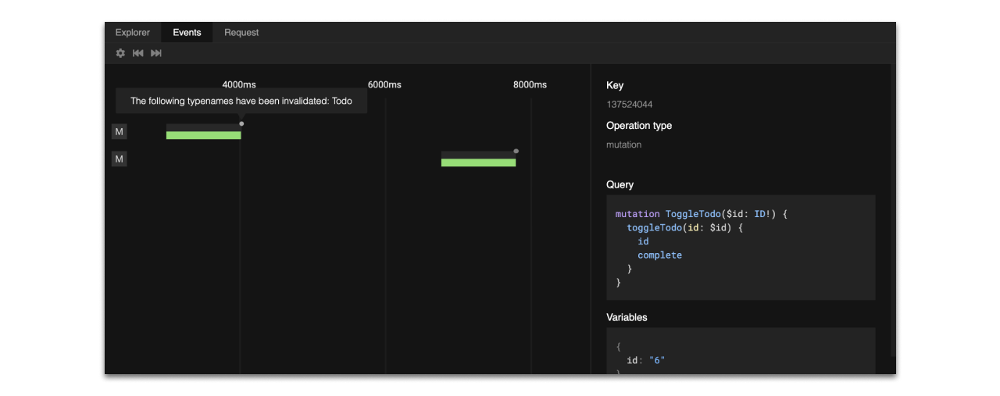

# Debugging

We've tried to make debugging in `urql` as seamless as possible by creating tools for users of `urql`
and those creating their own exchanges.

## Devtools

The quickest way to debug `urql` is to use the [`urql` devtools.](https://github.com/FormidableLabs/urql-devtools/)

It offers tools to inspect internal ["Debug Events"](#debug-events) as they happen, to explore data
as your app is seeing it, and to quickly trigger GraphQL queries.

[For instructions on how to set up the devtools, check out `@urql/devtools`'s readme in its
repository.](https://github.com/FormidableLabs/urql-devtools)



## Debug events

The "Debug Events" are internally what displays more information to the user on the devtools'
"Events" tab than just [Operations](../api/core.md#operation) and [Operation
Results](../api/core.md#operationresult).

Events may be fired inside exchanges to add additional development logging to an exchange.
The `fetchExchange` for instance will fire a `fetchRequest` event when a request is initiated and
either a `fetchError` or `fetchSuccess` event when a result comes back from the GraphQL API.

The [Devtools](#browser-devtools) aren't the only way to observe these internal events.
Anyone can start listening to these events for debugging events by calling the
[`Client`'s](../api/core.md#client) `client.subscribeToDebugTarget()` method.

Unlike `Operation`s these events are fire-and-forget events that are only used for debugging. Hence,
they shouldn't be used for anything but logging and not for messaging. **Debug events are also
entirely disabled in production.**

### Subscribing to Debug Events

Internally the `devtoolsExchange` calls the `client.subscribeToDebugTarget`, but if we're looking to
build custom debugging tools, it's also possible to call this function directly and to replace the
`devtoolsExchange`.

```
const { unsubscribe } = client.subscribeToDebugTarget(event => {
  if (event.source === 'dedupExchange')
    return;
  console.log(event); // { type, message, operation, data, source, timestamp }
});
```

As demonstrated above, the `client.subscribeToDebugTarget` accepts a callback function and returns
a subscription with an `unsubscribe` method. We've seen this pattern in the prior ["Stream Patterns"
section.](../concepts/stream-patterns.md#the-wonka-library)

## Adding your own Debug Events

Debug events are a means of sharing implementation details to consumers of an exchange. If you're
creating an exchange and want to share relevant information with the `devtools`, then you may want
to start adding your own events.

#### Dispatching an event

In the ["Exchanges" section](../concepts/exchanges.md) we've learned about the [`ExchangeInput`
object](../api/core.md#exchangeinput), which comes with a `client` and a `forward` property.
It also contains a `dispatchDebug` property.

It is called with an object containing the following properties:

| Prop      | Type        | Description                                                                           |
| --------- | ----------- | ------------------------------------------------------------------------------------- |
| type      | `string`    | A unique type identifier for the Debug Event.                                         |
| message   | `string`    | A human readable description of the event.                                            |
| operation | `Operation` | The [`Operation`](../api/core.md#operation) that the event targets.                   |
| data      | `?object`   | This is an optional payload to include any data that may become useful for debugging. |

For instance, we may call `dispatchDebug` with our `fetchRequest` event. This is the event that the
`fetchExchange` uses to notify us that a request has commenced:

```ts
export const fetchExchange: Exchange = ({ forward, dispatchDebug }) => {
  // ...

  return ops$ => {
    return pipe(
      ops$,
      // ...
      mergeMap(operation => {
        dispatchDebug({
          type: 'fetchRequest',
          message: 'A network request has been triggered',
          operation,
          data: {
            /* ... */
          },
        });

        // ...
      })
    );
  };
};
```

If we're adding new events that aren't included in the main `urql` repository and are using
TypeScript, we may also declare a fixed type for the `data` property, so we can guarantee a
consistent payload for our Debug Events. This also prevents accidental conflicts.

```ts
// urql.d.ts
import '@urql/core';

declare module '@urql/core' {
  interface DebugEventTypes {
    customEventType: { somePayload: string };
  }
}
```

Read more about extending types, like `urql`'s `DebugEventTypes` on the [TypeScript docs on
declaration merging](https://www.typescriptlang.org/docs/handbook/declaration-merging.html).

### Tips

Lastly, in summary, here are a few tips, dos, and don'ts that are important when we're adding new
Debug Events to custom exchanges.

- ✅ **Share internal details**: Frequent debug messages on key events inside your exchange are very
  useful when later inspecting them, e.g. in the `devtools`.
- ✅ **Create unique event types** : Key events should be easily identifiable and have a unique
  names.
- ❌ **Don't listen to debug events inside your exchange**: While it's possible to call
  `client.subscsubscribeToDebugTarget` in an exchange it's only valuable when creating a debugging
  exchange, like the `devtoolsExchange`.
- ❌ **Don't send warnings in debug events**: Informing your user about warnings isn't effective
  when the event isn't seen. You should still rely on `console.warn` so all users see your important
  warnings.
