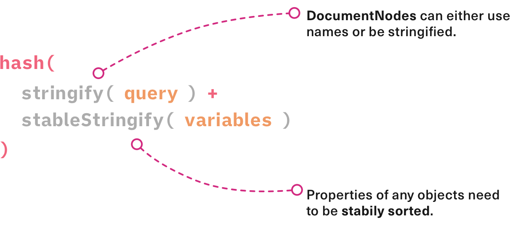

# Document Caching

By default `urql` uses a concept called _Document Caching_. It will avoid sending the same requests
to a GraphQL API repeatedly by caching the result of each query.

This works like the cache in a browser. `urql` creates a key for each request that is sent based on
a query and its variables.

The default _document caching_ logic is implemented in the default `cacheExchange`. We'll learn more
about ["Exchanges" on a later page.](../concepts/exchanges.md)

## Operation Keys



Once a result comes in it's cached indefinitely by its key. This means that each unique request
can have exactly one cached result.

However, we also need to invalidate the cached results so that requests are sent again and updated,
when we know that some results are out-of-date. With document caching we assume that a result may
be invalidated by a mutation that executes on data that has been queried previously.

In GraphQL the client can request additional type information by adding the `__typename` field to a
query's _selection set_. This field returns the name of the type for an object in the results, and
we use it to detect commonalities and data dependencies between queries and mutations.


In short, when we send a mutation that contains types that another query's results contains as well,
that query's result is removed from the cache.

This is an aggressive form of cache invalidation. However, it works well for content-driven sites,
while it doesn't deal with normalized data or IDs.

## Request Policies

[We previously covered request policies on the "Queries" page.](./queries.md)

The _request policy_ that is defined will alter what the default document cache does. By default the
cache will prefer cached results and will otherwise send a request, which is called `cache-first`,
but there's also `cache-and-network`, `cache-only`, and `network-only`.

[Read more about which request policies are available in the API
docs.](../api/core.md#requestpolicy-type)

## Document Cache Gotchas

This cache has a small trade-off! If we request a list of data and the API returns an empty list,
the cache won't be able to see the `__typename` of said list and won't invalidate.

There are two ways to fix this issue, supplying `additionalTypenames` to the context of your query or [switch to "Normalized Caching"
instead](../graphcache/normalized-caching.md).

### Adding typenames

This will elaborate about the first fix for empty lists, the `additionalTypenames`.

Example where this would occur:

```js
const query = `query { todos { id name } }`;
const result = { todos: [] };
```

At this point we don't know what types are possible for this query, so a best practice when using
the default cache is to add `additionalTypenames` for this query.

```js
// Keep the reference stable.
const context = useMemo(() => ({ additionalTypenames: ['Todo'] }), []);
const [result] = useQuery({ query, context });
```

Now the cache will know when to invalidate this query even when the list is empty.

We also have the possibility to use this for `mutations`.
There are moments where a mutation can cause a side-effect on your server side and it needs
to invalidate an additional entity.

```js
const [result, execute] = useMutation(`mutation($name: String!) { createUser(name: $name) }`);

const onClick = () => {
  execute({ name: 'newName' }, { additionalTypenames: ['Wallet'] });
};
```

Now our `mutation` knows that when it completes it has an additional type to invalidate.
