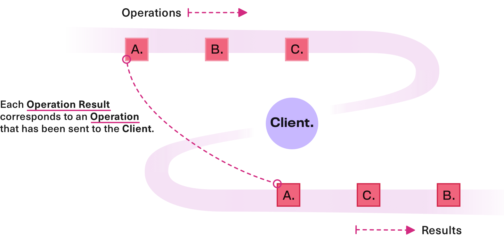

# Stream Patterns

As we've learned in the previous section on [philosophy](./philosophy.md), `urql`'s main way of handling GraphQL requests
is by abstracting them as streams of operations and results.

## Streams on the Client

The client abstracts GraphQL requests in a number of ways:

- as _Operations_
- descriptions of the GraphQL request
- the query and related variables
- additional information that is configured on the `Client`, such as
  the `url` and `fetchOptions`.



Internally the `Client` is an event hub. It defines a stream of operations as inputs, sends them
through a layer that will ultimately send GraphQL requests to an API, and then send the corresponding results
to another stream.

As a user working with framework code we never interact with these streams directly, but it's helpful to know that they describe
every interaction between the declarative queries we write and the way that `urql` fulfills them.

## Streams in JavaScript

Generally we refer to _streams_ as abstractions that allow us to program with asynchronous streams of
events over time. Within the JavaScript context we're thinking specifically in terms of of
[Observables](https://github.com/tc39/proposal-observable)
and [Reactive Programming with Observables.](http://reactivex.io/documentation/observable.html)

These concepts can be quite intimidating, if you're new to them, but from a high-level view what
we're talking about can be thought of as a "combination of Promises and Arrays".
Arrays because we're dealing with multiple items, and Promises because these items arrive
asynchronously.

Also most Observable libraries come with a toolkit of helper functions that are similar to the
methods on arrays, so you're likely to see `map` and `filter` — amongst other utilities — in those
libraries.

Read [this Gist](https://gist.github.com/staltz/868e7e9bc2a7b8c1f754) for a more in-depth
explanation.

## The Wonka library

`urql` utilises the [Wonka](https://github.com/kitten/wonka) library for its streams. It has a
few advantages that are specifically tailored for the `urql` library and ecosystem:

- It is extremely lightweight and treeshakeable, with a size of around 3.7kB minzipped.
- It's cross-platform and cross-language compatible, having been written in
  [Reason](https://reasonml.github.io/) and provides support for [Flow](https://flow.org/)
  and [TypeScript](https://www.typescriptlang.org/v2/).
- It's a predictable and iterable toolchain, emitting synchronous events whenever possible.

Typical usage of Wonka will involve creating a _source_ of some values and a _sink_.

```js
import { fromArray, map, subscribe, pipe } from 'wonka';

const { unsubscribe } = pipe(
  fromArray([1, 2, 3]),
  map(x => x * 2),
  subscribe(x => {
    console.log(x); // 2, 4, 6
  })
);
```

In Wonka, like with Observables, streams are cancellable by calling the `unsubscribe` method that a
subscription returns.

Read more about Wonka in its [documentation](https://wonka.kitten.sh/basics/background).

## Client Query Streams

Internally the `Client` has methods that may be used to execute queries, mutations, and
subscriptions. These methods typically return `Wonka` streams that, when subscribed to, will
emit results for a given query.

When a result can be retrieved from an in-memory cache, the stream may even emit the result
synchronously — rather than asynchronously.

There are three methods for each type of operation that GraphQL supports;
`executeQuery`, `executeMutation`, and `executeSubscription`. All these methods are
convenience wrappers around `executeRequestOperation` that create an operation and return a stream.

There are also convenience wrappers around the "execute" methods that are useful when using `urql`
in a Node.js environment. They are the `query`, `mutation`, and `subscription` methods.

```js
import { pipe, subscribe } from 'wonka';

const QUERY = `
  query Test($id: ID!) {
    getUser(id: $id) {
      id
      name
    }
  }
`;

const { unsubscribe } = pipe(
  client.query(QUERY, { id: 'test' }),
  subscribe(result => {
    console.log(result); // { data: ... }
  })
);
```

All methods on the `Client` internally emit an operation on an "operations stream" and the result
for this operation will be filtered out of all results and delivered to your stream.
There are several of these convenience methods in `urql` that make it easier to work with the
concept of GraphQL operation and result streams.

Read more about the available APIs on the `Client` in the [Core API docs](../api/core.md).
