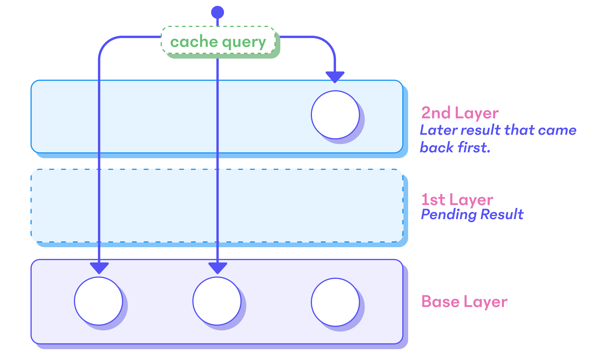

# Normalized Caching

In GraphQL, like its name suggests, we create schemas that express the relational nature of our
data. When we create and query against a `Query` type we walk a graph that starts at the root
`Query` type and walks through relational types. Rather than querying for normalized data, in
GraphQL our queries request a specific shape of denormalized data, a view into our relational data
that can be re-normalized automatically.

As the GraphQL API walks our query documents it may read from a relational database and _entities_
and scalar values are copied into a JSON document that matches our query document. The type
information of our entities isn't lost however. A query document may still ask the GraphQL API about
what entity it's dealing with using the `__typename` field, which dynamically introspects an
entity's type. This means that GraphQL clients can automatically re-normalize data as results come
back from the API by using the `__typename` field and keyable fields like an `id` or `_id` field,
which are already common conventions in GraphQL schemas. In other words, normalized caches can build
up a relational database of tables in-memory for our application.

For our apps normalized caches can enable more sophisticated use-cases, where different API requests
update data in other parts of the app and automatically update data in our cache as we query our
GraphQL API. Normalized caches can essentially keep the UI of our applications up-to-date when
relational data is detected across multiple queries, mutations, or subscriptions.

## Normalizing Relational Data

As previously mentioned, a GraphQL schema creates a tree of types where our application's data
always starts from the `Query` root type and is modified by other data that's incoming from either a
selection on `Mutation` or `Subscription`. All data that we query from the `Query` type will contain
relations between "entities", JSON objects that are hierarchical.

A normalized cache seeks to turn this denormalized JSON blob back into a relational data structure,
which stores all entities by a key that can be looked up directly. Since GraphQL documents give the
API a strict specification on how it traverses a schema, the JSON data that the cache receives from
the API will always match the GraphQL query document that has been used to query this data.
A common misconception is that normalized caches in GraphQL store data by the query document somehow,
however, the only thing a normalized cache cares about is that it can use our GraphQL query documents
to walk the structure of the JSON data it received from the API.

```graphql
{
  __typename
  todo(id: 1) {
    __typename
    id
    title
    author {
      __typename
      id
      name
    }
  }
}
```

```json
{
  "__typename": "Query",
  "todo": {
    "__typename": "Todo",
    "id": 1,
    "title": "implement graphcache",
    "author": {
      "__typename": "Author",
      "id": 1,
      "name": "urql-team"
    }
  }
}
```

Above, we see an example of a GraphQL query document and a corresponding JSON result from a GraphQL
API. In GraphQL, we never lose access to the underlying types of the data. Normalized caches can
ask for the `__typename` field in selection sets automatically and will find out which type a JSON
object corresponds to.

Generally, a normalized cache must do one of two things with a query document like the above:

- It must be able to walk the query document and JSON data of the result and cache the data,
  normalizing it in the process and storing it in relational tables.
- It must later be able to walk the query document and recreate this JSON data just by reading data
  from its cache, by reading entries from its in-memory relational tables.

While the normalized cache can't know the exact type of each field, thanks to the GraphQL query
language it can make a couple of assumptions. The normalized cache can walk the query document. Each
field that has no selection set (like `title` in the above example) must be a "record", a field that
may only be set to a scalar. Each field that does have a selection set must be another "entity" or a
list of "entities". The latter fields with selection sets are our relations between entities, like a
foreign key in relational databases.
Furthermore, the normalized cache can then read the `__typename` field on related entities. This is
called _Type Name Introspection_ and is how it finds out about the types of each entity.
From the above document we can assume the following relations:

- `Query.todo(id: 1)` → `Todo`
- `Todo.author` → `Author`

However, this isn't quite enough yet to store the relations from GraphQL results. The normalized
cache must also generate primary keys for each entity so that it can store them in table-like data
structures. This is for instance why [Relay
enforces](https://relay.dev/docs/en/graphql-server-specification.html#object-identification) that
each entity must have an `id` field. This allows it to assume that there's an obvious primary key
for each entity it may query. Instead, `urql`'s Graphcache and Apollo assume that there _may_ be an
`id` or `_id` field in a given selection set. If Graphcache can't find these two fields it'll issue
a warning, however a custom `keys` configuration may be used to generate custom keys for a given
type. With this logic the normalized cache will actually create the following "links" between its
relational data:

- `"Query"`, `.todo(id: 1)` → `"Todo:1"`
- `"Todo:1"`, `.author` → `"Author:1"`

As we can see, the `Query` root type itself has a constant key of `"Query"`. All relational data
originates here, since the GraphQL schema is a graph and, like a tree, all selections on a GraphQL
query document originate from it.
Internally, the normalized cache now stores field values on entities by their primary keys. The
above can also be said or written as:

- The `Query` entity's `todo` field with `{"id": 1}` arguments points to the `Todo:1` entity.
- The `Todo:1` entity's `author` field points to the `Author:1` entity.

In Graphcache, these "links" are stored in a nested structure per-entity. "Records" are kept
separate from this relational data.


## Storing Normalized Data

At its core, normalizing data means that we take individual fields and store them in a table. In our
case we store all values of fields in a dictionary of their primary key, generated from an ID or
other key and type name, and the field’s name and arguments, if it has any.

| Primary Key            | Field                                           | Value                    |
| ---------------------- | ----------------------------------------------- | ------------------------ |
| Type name and ID (Key) | Field name (not alias) and optionally arguments | Scalar value or relation |

To reiterate we have three pieces of information that are stored in tables:

- The entity's key can be derived from its type name via the `__typename` field and a keyable field.
  By default _Graphcache_ will check the `id` and `_id` fields, however this is configurable.
- The field's name (like `todo`) and optional arguments. If the field has any arguments then we can
  normalize it by JSON stringifying the arguments, making sure that the JSON key is stable by
  sorting its keys.
- Lastly, we may store relations as either `null`, a primary key that refers to another entity, or a
  list of such. For storing "records" we can store the scalars in a separate table.

In _Graphcache_ the data structure for these tables looks a little like the following, where each
entity has a record from fields to other entity keys:

```js
{
  links: Map {
    'Query': Record {
      'todo({"id":1})': 'Todo:1'
    },
    'Todo:1': Record {
      'author': 'Author:1'
    },
    'Author:1': Record { },
  }
}
```

We can see how the normalized cache is now able to traverse a GraphQL query by starting on the
`Query` entity and retrieve relations for other fields.
To retrieve "records" which are all fields with scalar values and no selection sets, _Graphcache_
keeps a second table around with an identical structure. This table only contains scalar values,
which keeps our non-relational data away from our "links":

```js
{
  records: Map {
    'Query': Record {
      '__typename': 'Query'
    },
    'Todo:1': Record {
      '__typename': 'Todo',
      'id': 1,
      'title': 'implement graphcache'
    },
    'Author:1': Record {
      '__typename': 'Author',
      'id': 1,
      'name': 'urql-team'
    },
  }
}
```

This is very similar to how we'd go about creating a state management store manually, except that
_Graphcache_ can use the GraphQL document to perform this normalization automatically.

What we gain from this normalization is that we have a data structure that we can both read from and
write to, to reproduce the API results for GraphQL query documents. Any mutation or subscription can
also be written to this data structure. Once _Graphcache_ finds a keyable entity in their results
it's written to its relational table which may update other queries in our application.
Similarly queries may share data between one another which means that they effectively share
entities using this approach and can update one another.
In other words, once we have a primary key like `"Todo:1"` we may find this primary key again in
other entities in other GraphQL results.

## Custom Keys and Non-Keyable Entities

In the above introduction we've learned that while _Graphcache_ doesn't enforce `id` fields on each
entity, it checks for the `id` and `_id` fields by default. There are many situations in which
entities may either not have a key field or have different keys.

As _Graphcache_ traverses JSON data and a GraphQL query document to write data to the cache you may
see a warning from it along the lines of ["Invalid key: [...] No key could be generated for the data
at this field."](./errors.md/#15-invalid-key) _Graphcache_ has many warnings like these that attempt
to detect undesirable behaviour and helps us to update our configuration or queries accordingly.

In the simplest cases, we may simply have forgotten to add the `id` field to the selection set of
our GraphQL query document. However, what if the field is instead called `uuid` and our query looks
accordingly different?

```graphql
{
  item {
    uuid
  }
}
```

In the above selection set we have an `item` field that has a `uuid` field rather than an `id`
field. This means that _Graphcache_ won't automatically be able to generate a primary key for this
entity. Instead, we have to help it generate a key by passing it a custom `keys` config:

```js
cacheExchange({
  keys: {
    Item: data => data.uuid,
  },
});
```

We may add a function as an entry to the `keys` configuration. The property here, `"Item"` must be
the typename of the entity for which we're generating a key. The function may return an arbitarily
generated key. So for our `item` field, which in our example schema gives us an `Item` entity, we
can create a `keys` configuration entry that creates a key from the `uuid` field rather than the
`id` field.

This also raises a question, **what does _Graphcache_ do with unkeyable data by default? And, what
if my data has no key?**<br />
This special case is what we call "embedded data". Not all types in a GraphQL schema will have
keyable fields and some types may just abstract data without themselves being relational. They may
be "edges", entities that have a field pointing to other entities that simply connect two entities,
or data types like a `GeoJson` or `Image` type.

In these cases, where the normalized cache encounters unkeyable types, it will create an embedded
key by using the parent's primary key and combining it with the field key. This means that
"embedded entities" are only reachable from a specific field on their parent entities. They're
globally unique and aren't strictly speaking relational data.

```graphql
{
  __typename
  todo(id: 1) {
    id
    image {
      url
      width
      height
    }
  }
}
```

In the above example we're querying an `Image` type on a `Todo`. This imaginary `Image` type has no
key because the image is embedded data and will only ever be associated to this `Todo`. In other
words, the API's schema doesn't consider it necessary to have a primary key field for this type.
Maybe it doesn't even have an ID in our backend's database. We _could_ assign this type an imaginary
key (maybe based on the `url`) but in fact if it's not shared data it wouldn't make much sense to
do so.

When _Graphcache_ attempts to store this entity it will issue the previously mentioned warning.
Internally, it'll then generate an embedded key for this entity based on the parent entity. If
the parent entity's key is `Todo:1` then the embedded key for our `Image` will become
`Todo:1.image`. This is also how this entity will be stored internally by _Graphcache_:

```js
{
  records: Map {
    'Todo:1.image': Record {
      '__typename': 'Image',
      'url': '...',
      'width': 1024,
      'height': 768
    },
  }
}
```

This doesn't however mute the warning that _Graphcache_ outputs, since it believes we may have made a
mistake. The warning itself gives us advice on how to mute it:

> If this is intentional, create a keys config for `Image` that always returns null.

Meaning, that we can add an entry to our `keys` config for our non-keyable type that explicitly
returns `null`, which tells _Graphcache_ that the entity has no key:

```js
cacheExchange({
  keys: {
    Image: () => null,
  },
});
```

## Non-Automatic Relations and Updates

While _Graphcache_ is able to store and update our entities in an in-memory relational data
structure, which keeps the same entities in singular unique locations, a GraphQL API may make a lot
of implicit changes to the relations of data as it runs or have trivial relations that our cache
doesn't need to see to resolve. Like with the `keys` config, we have two more configuration options
to combat this: `resolvers` and `updates`.

### Manually resolving entities

Some fields in our configuration can be resolved without checking the GraphQL API for relations. The
`resolvers` config allows us to create a list of client-side resolvers where we can read from the
cache directly as _Graphcache_ creates a local GraphQL result from its cached data.

```graphql
{
  todo(id: 1) {
    id
  }
}
```

Previously we've looked at the above query to illustrate how data from a GraphQL API may be written
to _Graphcache_'s relational data structure to store the links and entities in a result against this
GraphQL query document. However, it may be possible for another query to have already written this
`Todo` entity to the cache. So, **how do we resolve a relation manually?**

In such a case, _Graphcache_ may have seen and stored the `Todo` entity but isn't aware of the
relation between `Query.todo({"id":1})` and the `Todo:1` entity. However, we can tell _Graphcache_
which entity it should look for when it accesses the `Query.todo` field by creating a resolver for
it:

```js
cacheExchange({
  resolvers: {
    Query: {
      todo(parent, args, cache, info) {
        return { __typename: 'Todo', id: args.id };
      },
    },
  },
});
```

A resolver is a function that's similar to [GraphQL.js' resolvers on the
server-side](https://www.graphql-tools.com/docs/resolvers/). They receive the parent data, the
field's arguments, access to _Graphcache_'s cached data, and an `info` object. [The entire function
signature and more explanations can be found in the API docs.](../api/graphcache.md#resolvers-option)
Since it can access the field's arguments from the GraphQL query document, we can return a partial
`Todo` entity. As long as this
object is keyable, it will tell _Graphcache_ what the key of the returned entity is. In other words,
we've told it how to get to a `Todo` from the `Query.todo` field.

This mechanism is immensely more powerful than this example. We have two other use-cases that
resolvers may be used for:

- Resolvers can be applied to fields with records, which means that it can be used to change or
  transform scalar values. For instance, we can update a string or parse a `Date` right inside a
  resolver.
- Resolvers can return deeply nested results, which will be layered on top of the in-memory
  relational cached data of _Graphcache_, which means that it can emulate infinite pagination and
  other complex behaviour.

[Read more about resolvers on the following page about "Local Resolvers".](./local-resolvers.md)

### Manual cache updates

While `resolvers`, as shown above, operate while _Graphcache_ is reading from its in-memory cache,
`updates` are a configuration option that operate while _Graphcache_ is writing to its cached data.
Specifically, these functions can be used to add more updates onto what a `Mutation` or
`Subscription` may automatically update.

As stated before, a GraphQL schema's data may undergo a lot of implicit changes when we send it a
`Mutation` or `Subscription`. A new item that we create may for instance manipulate a completely
different item or even a list. Often mutations and subscriptions alter relations that their
selection sets wouldn't necessarily see. Since mutations and subscriptions operate on a different
root type, rather than the `Query` root type, we often need to update links in the rest of our data
when a mutation is executed.

```graphql
query TodosList {
  todos {
    id
    title
  }
}

mutation AddTodo($title: String!) {
  addTodo(title: $title) {
    id
    title
  }
}
```

In a simple example, like the one above, we have a list of todos in a query and create a new todo
using the `Mutation.addTodo` mutation field. When the mutation is executed and we get the result
back, _Graphcache_ already writes the `Todo` item to its normalized cache. However, we also want to
add the new `Todo` item to the list on `Query.todos`:

```js
import { gql } from '@urql/core';

cacheExchange({
  updates: {
    Mutation: {
      addTodo(result, args, cache, info) {
        const query = gql`
          {
            todos {
              id
            }
          }
        `;
        cache.updateQuery({ query }, data => {
          data.todos.push(result.addTodo);
          return data;
        });
      },
    },
  },
});
```

In this code example we can first see that the signature of the `updates` entry is very similar to
the one of `resolvers`. However, we're seeing the `cache` in use for the first time. The `cache`
object (as [documented in the API docs](../api/graphcache.md#cache)) gives us
access to _Graphcache_'s mechanisms directly. Not only can we resolve data using it, we can directly
start sub-queries or sub-writes manually. These are full normalized cache runs inside other runs. In
this case we're calling `cache.updateQuery` on a list of `Todo` items while the `Mutation` that
added the `Todo` is already being written to the cache.

As we can see, we may perform manual changes inside of `updates` functions, which can be used to
affect other parts of the cache (like `Query.todos` here) beyond the automatic updates that a
normalized cache is expected to perform.

We get methods like `cache.updateQuery`, `cache.writeFragment`, and `cache.link` in our updater
functions, which aren't available to us in local resolvers, and can only be used in these `updates`
entries to change the data that the cache holds.

[Read more about writing cache updates on the "Cache Updates" page.](./cache-updates.md)

## Deterministic Cache Updates

Above, in [the "Storing Normalized Data" section](#storing-normalized-data), we've talked about how
Graphcache is able to store normalized data. However, apart from storing this data there are a
couple of caveats that many applications simply ignore, skip, or simplify when they implement a
store to cache their data in.

Amongst features like [Optimistic Updates](./cache-updates.md#optimistic-updates) and [Offline
Support](./offline.md), Graphcache supports several features that allow our API results to be more
unreliable. Essentially we don't expect API results to always come back in order or on time.
However, we expect Graphcache to prevent us from making "indeterministic cache updates", meaning
that we expect it to handle API results that come back in a random order and delayed gracefully.

In terms of the ["Manual Cache Updates"](#manual-cache-updates) that we've talked about above and
[Optimistic Updates](./cache-updates.md#optimistic-updates) the limitations are pretty simple at
first and if we use Graphcache as usual we may not even notice them:

- When we make an _optimistic_ change, we define what a mutation's result may look like once the API
  responds in the future and apply this temporary result immediately. We store this temporary data
  in a separate "layer". Once the real result comes back this layer can be deleted and the real API
  result can be applied as usual.
- When multiple _optimistic updates_ are made at the same time, we never allow these layers to be
  deleted separately. Instead Graphcache waits for all mutations to complete before deleting the
  optimistic layers and applying the real API result. This means that a mutation update cannot
  accidentally commit optimistic data to the cache permanently.
- While an _optimistic update_ has been applied, Graphcache stops refetching any queries that contain
  this optimistic data so that it doesn't "flip back" to its non-optimistic state without the
  optimistic update being applied. Otherwise we'd see a "flicker" in the UI.

These three principles are the basic mechanisms we can expect from Graphcache. The summary is:
**Graphcache groups optimistic mutations and pauses queries so that optimistic updates look as
expected,** which is an implementation detail we can mostly ignore when using it.

However, one implementation detail we cannot ignore is the last mechanism in Graphcache which is
called **"Commutativity"**. As we can tell, "optimistic updates" need to store their normalized
results on a separate layer. This means that the previous data structure we've seen in Graphcache is
actually more like a list, with many tables of links and entities.

Each layer may contain optimistic results and have an order of preference. However, this order also
applies to queries. Since queries are run in one order but their API results can come back to us in
a very different order, if we access enough pages in a random order things can sometimes look rather
weird. We may see that in an application on a slow network connection the results may vary depending
on when their results came back.



Instead, Graphcache actually uses layers for any API result it receives. In case, an API result
arrives out-of-order, it sorts them by precedence — or rather by when they've been requested.
Overall, we don't have to worry about this, but Graphcache has mechanisms that keep our updates
safe.

## Reading on

This concludes the introduction to Graphcache with a short overview of how it works, what it
supports, and some hidden mechanisms and internals. Next we may want to learn more about how to use
it and more of its features:

- [How do we write "Local Resolvers"?](./local-resolvers.md)
- [How to set up "Cache Updates" and "Optimistic Updates"?](./cache-updates.md)
- [What is Graphcache's "Schema Awareness" feature for?](./schema-awareness.md)
- [How do I enable "Offline Support"?](./offline.md)
