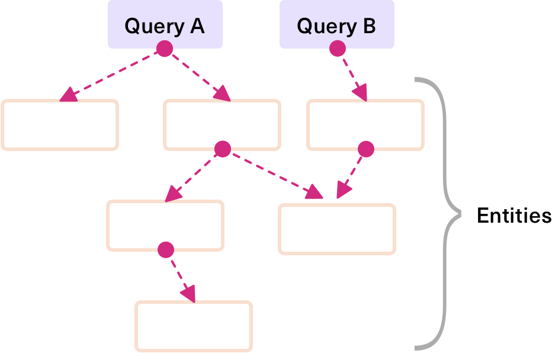

# Introduction

<!-- TODO: Write about urql -->

## Motivation

<!-- TODO: Why is urql a thing? What can the user expect? -->

## Getting Started

<!-- TODO: Link to getting started in Basics and add note on core vs framework-wrappers -->

## Client and Operations

In `urql` all operations are controlled by a central `Client`.
This client is responsible for managing GraphQL operations and sending requests.

When you use `urql` operations are dispatched on the client (A, B, C) which will be handled by the client on a
single stream of inputs. As responses come back from the cache or your GraphQL API one or more results are
dispatched on an output stream that correspond to the operations, which update the hooks.

Hence the client can be seen as an event hub. Operations are sent to the client, which executes them and
sends back a result. A special teardown-event is issued when a hook unmounts or updates to a different
operation.

## Document Caching

By default `urql` uses document caching.

<!-- TODO: Explain document caching -->

The default cache in `urql` works like a document or page cache, for example like a browser would cache pages.
With this default behavior results are cached by the operation key that requested them. This means that
each unique operation can have exactly one cached result.

These results are aggressively invalidated. Whenever you send a mutation, each result that contains `__typename`s
that also occur in the mutation result is invalidated.

## Normalized Caching

You can choose to use normalized caching instead.

<!-- TODO: Link to Graphcache -->

